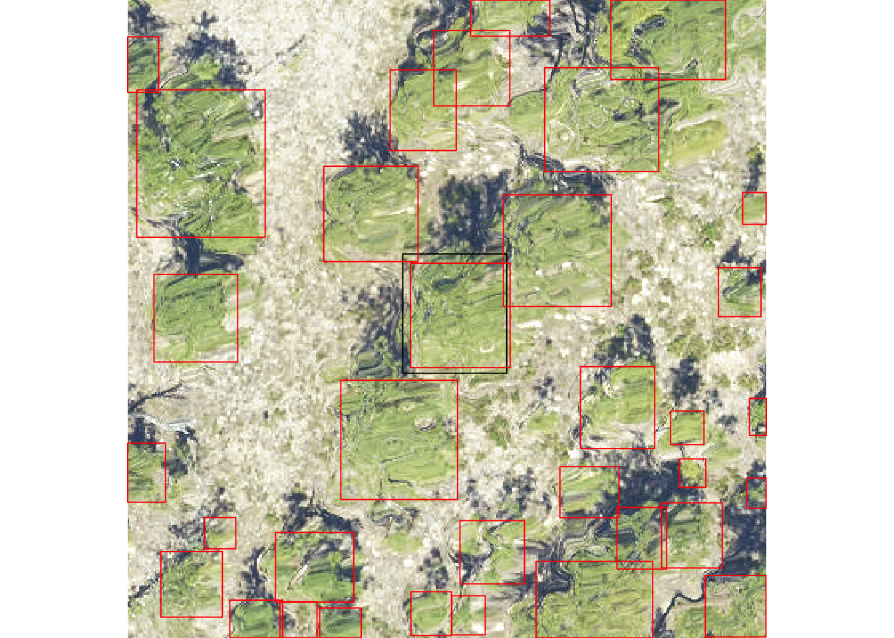
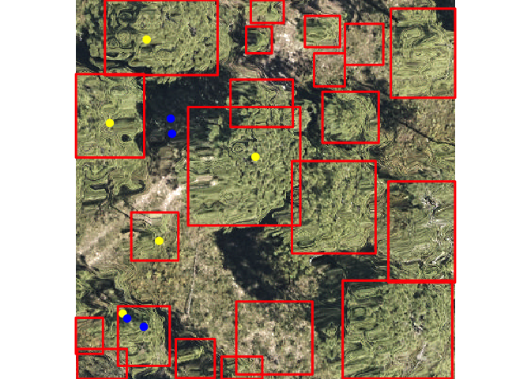

[](https://travis-ci.org/Weecology/NeonTreeEvaluation_package)

A multi-sensor benchmark dataset for detecting individual trees in airborne RGB, Hyperspectral and LIDAR point clouds
=====================================================================================================================

Maintainer: Ben Weinstein - University of Florida.

This benchmark dataset is the first dataset to have consistent
annotation approach across a variety of ecosystems. This repo is the R
package for reproducible evaluation against the dataset. There are three
types of annotated data.

Image-annotated Crowns
----------------------

The main data source are image-annotated crowns, in which a single
observer annotated visible trees in 200 40m x 40m images from across the
United States.

Field-annotated Crowns
----------------------

The second data source is a small number of field-deliniated crowns from
three geographic sites. These crowns were drawn on a tablet while
physically standing in the field, thereby reducing the uncertainty in
crown segmentation.

Field Stems
-----------

The third data source is the NEON Woody Vegetation Structure Dataset.
Each tree stem is represented by a single point. This data has been
filtered to represent overstory trees visible in the remote sensing
imagery.

Installation
============

``` r
library(devtools)
install_github("https://github.com/weecology/NeonTreeEvaluation_package.git")
```

Download sensor data
====================

To download evaluation data from the Zenodo archive (1GB), use the
download() function to place the data in the correct package location.
Download the much larger training data, set training=TRUE.

``` r
library(NeonTreeEvaluation)
download()
#> NULL
```

Getting Started
===============

The package contains two vignettes. The ‘Data’ vignette describes each
datatype and how to interact with it in R. The ‘Evaluation’ vignette
shows how to submit predictions to the benchmark.

Submission Format
=================

The format of the submission is as follows

-   A csv file
-   5 columns: Plot Name, xmin, ymin, xmax, ymax

Each row contains information for one predicted bounding box.

The plot column should be named the same as the files in the dataset
(e.g. SJER\_021), not the path to the file.

Example
=======

The package contains a sample submission file.

``` r
library(raster)
library(dplyr)
library(NeonTreeEvaluation)
data("submission")
head(submission)
#>   plot_name       xmin       ymin     xmax      ymax
#> 1  BLAN_005 299.532560  13.216835 396.9573 123.17089
#> 2  BLAN_005   6.189451 217.012850 113.7897 325.25092
#> 3  BLAN_005 255.822100 181.132950 309.3961 245.84946
#> 4  BLAN_005 256.380600 283.993260 334.1573 376.96796
#> 5  BLAN_005 107.644630   5.248255 177.9518  85.23382
#> 6  BLAN_005 173.360230 341.138150 255.3800 400.00000
```

Precision and recall scores for an image-annotated plot
-------------------------------------------------------

This submission has bounding boxes in image coordinates. To get the
benchmark score image-annotated ground truth data.

``` r
#Get a three sample plots to run quickly, ignore to run the entire dataset
df<-submission %>% filter(plot_name %in% c("SJER_052","TEAK_061","TEAK_057"))

#Compute total recall and precision for the overlap data
results<-evaluate_image_crowns(submission = df,project = T, show=F, summarize = T)
#> [1] SJER_052
#> 181 Levels: 2018_SJER_3_252000_4104000_image_628 ...
#> [1] TEAK_057
#> 181 Levels: 2018_SJER_3_252000_4104000_image_628 ...
#> [1] TEAK_061
#> 181 Levels: 2018_SJER_3_252000_4104000_image_628 ...
results
#> $overall
#> # A tibble: 1 x 2
#>   precision recall
#>       <dbl>  <dbl>
#> 1     0.765  0.780
#> 
#> $by_site
#> # A tibble: 2 x 3
#> # Groups:   Site [2]
#>   Site  recall precision
#>   <chr>  <dbl>     <dbl>
#> 1 SJER   1         1    
#> 2 TEAK   0.676     0.657
#> 
#> $plot_level
#> # A tibble: 3 x 3
#> # Groups:   plot_name [3]
#>   plot_name submission ground_truth
#>   <fct>          <int>        <int>
#> 1 SJER_052           9            9
#> 2 TEAK_057          61           61
#> 3 TEAK_061          44           41
```

If you would prefer not to clone this repo, a static version of the
benchmark is here:
<a href="https://zenodo.org/record/3723357#.XqT_HlNKjOQ" class="uri">https://zenodo.org/record/3723357#.XqT_HlNKjOQ</a>

Sensor Data
===========

The NeonTreeEvaluation dataset is a set of bounding boxes drawn on RGB
imagery from the National Ecological Observation Network (NEON). NEON is
a set of 45 sites
(e.g. [TEAK](https://www.neonscience.org/field-sites/field-sites-map/TEAK))
that cover the dominant ecosystems in the US.

For more complete information see the data vignette.

RGB
---

``` r
library(raster)
library(NeonTreeEvaluation)

#Read RGB image as projected raster
rgb_path<-get_data(plot_name = "SJER_021",type="rgb")
rgb<-stack(rgb_path)

#Find path and parse
xmls<-get_data("SJER_021",type="annotations")
annotations<-xml_parse(xmls)
#View one plot's annotations as polygons, project into UTM
#copy project utm zone (epsg), xml has no native projection metadata
xml_polygons <- boxes_to_spatial_polygons(annotations,rgb)

plotRGB(rgb)
plot(xml_polygons,add=T)
```



Lidar
-----

To access the draped lidar hand annotations, use the “label” column.
Each tree has a unique integer.

``` r
library(lidR)
path<-get_data("TEAK_052",type="lidar")
r<-readLAS(path)
trees<-lasfilter(r,!label==0)
plot(trees,color="label")
```

We elected to keep all points, regardless of whether they correspond to
tree annotation. Non-tree points have value 0. We highly recommend
removing these points before predicting the point cloud. Since the
annotations were made in the RGB and then draped on to the point cloud,
there will naturally be some erroneous points at the borders of trees.

Hyperspectral
-------------

Hyperspectral surface reflectance (NEON ID: DP1.30006.001) is a 426 band
raster covering visible and near infrared spectrum.

``` r
path<-get_data("MLBS_071",type="hyperspectral")
g<-stack(path)
nlayers(g)
#> [1] 426
#Grab a three band combination to view as false color
f<-g[[c(52,88,117)]]
plotRGB(f,stretch="lin")
```



Submission
==========

To submit to this benchmark, please see the evaluation vignette. Please
submit a pull request, or contact the maintainer if you use these data
in analysis and would like the results to be shown here.

Citation
--------

<sup>1</sup> Weinstein, Ben G., et al. “Individual tree-crown detection
in RGB imagery using semi-supervised deep learning neural networks.”
Remote Sensing 11.11 (2019): 1309.
<a href="https://www.mdpi.com/2072-4292/11/11/1309" class="uri">https://www.mdpi.com/2072-4292/11/11/1309</a>
