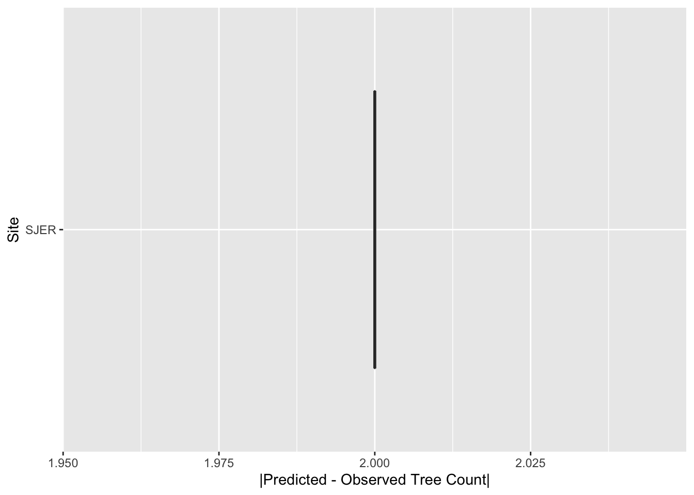
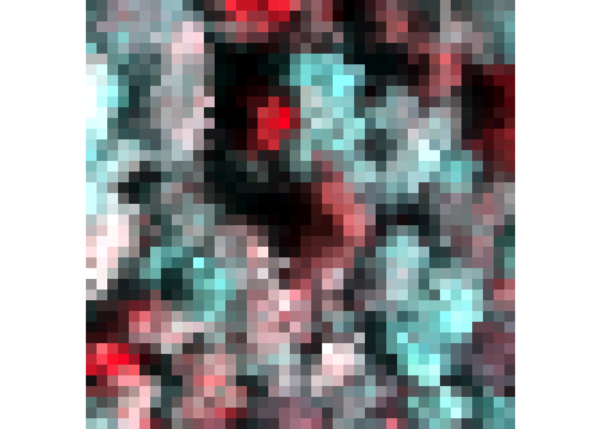

[](https://travis-ci.org/Weecology/NeonTreeEvaluation_package)

A multi-sensor benchmark dataset for detecting individual trees in airborne RGB, Hyperspectral and LIDAR point clouds
=====================================================================================================================

Maintainer: Ben Weinstein - University of Florida.

This benchmark dataset is the first dataset to have consistent
annotation approach across a variety of ecosystems. This repo is the R
package for reproducible evaluation against the dataset.

Installation
============

``` r
library(devtools)
install_github("Weecology/NeonTreeEvaluation_package")
```

Download sensor data
====================

To download evaluation data from the Zenodo archive (1GB), use the
download() function to place the data in the correct package location.
Download the much larger training data, set training=TRUE.

``` r
library(NeonTreeEvaluation)
download()
```

Getting Started
===============

The package contains two vignettes. The ‘Data’ vignette describes each
datatype and how to interact with it in R. The ‘Evaluation’ vignette
shows how to submit predictions to the benchmark.

Submission Format
=================

The format of the submission is as follows

-   A csv file
-   5 columns: Plot Name, xmin, ymin, xmax, ymax

Each row contains information for one predicted bounding box.

The plot column should be named the same as the files in the dataset
without extension (e.g. SJER\_021 not SJER\_021.tif) and not the full
path to the file on disk. Not all evaluation data are available for all
plots. Functions like evaluate\_field\_crowns and
evaluate\_image\_crowns will look for matching plot name and ignore
other plots.Depending on the speed of the algorithm, the simplest thing
to do is predict all images in the RGB folder (see list\_rgb()) and the
package will handle matching images with the correct data to the correct
evaluation procedure.

Example
=======

The package contains a sample submission file.

``` r
library(raster)
library(dplyr)
library(NeonTreeEvaluation)
data("submission")
head(submission)
#>        xmin     ymin     xmax     ymax     score label plot_name
#> 1 217.24730 265.0254 290.4331 337.5056 0.7930149  Tree  ABBY_020
#> 2 284.37094 339.3117 338.5593 388.7977 0.7155186  Tree  ABBY_020
#> 3 197.60432 350.3243 249.3276 400.0000 0.7128302  Tree  ABBY_020
#> 4  25.21722 186.6763 123.3826 283.8552 0.6598154  Tree  ABBY_020
#> 5 332.43198 293.3734 377.3869 343.7137 0.6279798  Tree  ABBY_020
#> 6 198.98254 181.8541 266.0995 249.9332 0.5793932  Tree  ABBY_020
```

Scores for an image-annotated crowns
------------------------------------

| Author                | Precision | Recall | Description                       |     |
|-----------------------|-----------|--------|-----------------------------------|-----|
| Weinstein et al. 2020 | 0.55      | 0.65   | Semi-supervised RGB Deep Learning |     |
| Silva et al. 2016     | 0.23      | 0.33   | Unsupervised LiDAR raster         |     |
| Dalponte et al 2016   | 0.23      | 0.34   | Unsupervised LidAR raster         |     |
| Li et al. 2012        | 0.06      | 0.12   | Unsupervised LiDAR point cloud    |     |

The main data source are image-annotated crowns, in which a single
observer annotated visible trees in 200 40m x 40m images from across the
United States. This submission has bounding boxes in image coordinates.
To get the benchmark score image-annotated ground truth data.

``` r
#Get a three sample plots to run quickly, ignore to run the entire dataset
df<-submission %>% filter(plot_name %in% c("SJER_052","TEAK_061","TEAK_057"))

#Compute total recall and precision for the overlap data
results<-evaluate_image_crowns(submission = df,project = T, show=F, summarize = T)
#> [1] SJER_052
#> 1292 Levels: 2018_SJER_3_252000_4104000_image_628 ...
#> [1] TEAK_057
#> 1292 Levels: 2018_SJER_3_252000_4104000_image_628 ...
#> [1] TEAK_061
#> 1292 Levels: 2018_SJER_3_252000_4104000_image_628 ...
results
#> $overall
#> # A tibble: 1 x 2
#>   precision recall
#>       <dbl>  <dbl>
#> 1     0.838  0.839
#> 
#> $by_site
#> # A tibble: 2 x 3
#> # Groups:   Site [2]
#>   Site  recall precision
#>   <chr>  <dbl>     <dbl>
#> 1 SJER   0.778     1    
#> 2 TEAK   0.881     0.754
#> 
#> $plot_level
#> # A tibble: 3 x 3
#> # Groups:   plot_name [3]
#>   plot_name submission ground_truth
#>   <fct>          <int>        <int>
#> 1 SJER_052           7            9
#> 2 TEAK_057          75           60
#> 3 TEAK_061          43           41
#> 
#> $count_error
```



For a list of NEON site abbreviations:
<a href="https://www.neonscience.org/field-sites/field-sites-map" class="uri">https://www.neonscience.org/field-sites/field-sites-map</a>

Scores for an field-annotated crowns
------------------------------------

| Author                | Precision | Recall | Description                       |     |
|-----------------------|-----------|--------|-----------------------------------|-----|
| Weinstein et al. 2020 | 0.55      | 0.65   | Semi-supervised RGB Deep Learning |     |
| Silva et al. 2016     | 0.23      | 0.33   | Unsupervised LiDAR raster         |     |
| Dalponte et al 2016   | 0.23      | 0.34   | Unsupervised LidAR raster         |     |
| Li et al. 2012        | 0.06      | 0.12   | Unsupervised LiDAR point cloud    |     |

The second data source is a small number of field-deliniated crowns from
three geographic sites. These crowns were drawn on a tablet while
physically standing in the field, thereby reducing the uncertainty in
crown segmentation.

``` r
df <- submission %>% filter(plot_name=="OSBS_95_competition")
results<-evaluate_field_crowns(submission = df,project = T)
#> [1] OSBS_95_competition
#> 1292 Levels: 2018_SJER_3_252000_4104000_image_628 ...
```


``` r
results
#> $overall
#> # A tibble: 1 x 2
#>   precision recall
#>       <dbl>  <dbl>
#> 1     0.029      1
#> 
#> $by_site
#> # A tibble: 1 x 3
#> # Groups:   Site [1]
#>   Site    recall precision
#>   <chr>    <dbl>     <dbl>
#> 1 OSBS_95      1     0.029
#> 
#> $plot_level
#> # A tibble: 1 x 3
#> # Groups:   plot_name [1]
#>   plot_name           submission ground_truth
#>   <fct>                    <int>        <int>
#> 1 OSBS_95_competition         34            1
```

Scores for an field-collected stems
-----------------------------------

| Author                | Precision | Recall | Description                       |     |
|-----------------------|-----------|--------|-----------------------------------|-----|
| Weinstein et al. 2020 | 0.55      | 0.65   | Semi-supervised RGB Deep Learning |     |
| Silva et al. 2016     | 0.23      | 0.33   | Unsupervised LiDAR raster         |     |
| Dalponte et al 2016   | 0.23      | 0.34   | Unsupervised LidAR raster         |     |
| Li et al. 2012        | 0.06      | 0.12   | Unsupervised LiDAR point cloud    |     |

The third data source is the NEON Woody Vegetation Structure Dataset.
Each tree stem is represented by a single point. This data has been
filtered to represent overstory trees visible in the remote sensing
imagery.

``` r
df <- submission %>% filter(plot_name=="JERC_049")
results<-evaluate_field_stems(submission = df,project = F, show=T, summarize = T)
#> [1] "JERC_049"
```


``` r
results
#> $overall
#>      recall
#> 1 0.5555556
#> 
#> $by_site
#> # A tibble: 1 x 2
#>   Site  recall
#>   <fct>  <dbl>
#> 1 JERC   0.556
#> 
#> $plot_level
#>   siteID plot_name    recall n
#> 1   JERC  JERC_049 0.5555556 9
```

If you would prefer not to clone this repo, a static version of the
benchmark is here:
<a href="https://zenodo.org/record/3723357#.XqT_HlNKjOQ" class="uri">https://zenodo.org/record/3723357#.XqT_HlNKjOQ</a>

Sensor Data
===========

RGB Camera
----------

``` r
library(raster)
library(NeonTreeEvaluation)

#Read RGB image as projected raster
rgb_path<-get_data(plot_name = "SJER_021",type="rgb")
rgb<-stack(rgb_path)

#Find path and parse
xmls<-get_data("SJER_021",type="annotations")
annotations<-xml_parse(xmls)
#View one plot's annotations as polygons, project into UTM
#copy project utm zone (epsg), xml has no native projection metadata
xml_polygons <- boxes_to_spatial_polygons(annotations,rgb)

plotRGB(rgb)
plot(xml_polygons,add=T)
```


Lidar
-----

To access the draped lidar hand annotations, use the “label” column.
Each tree has a unique integer.

``` r
library(lidR)
path<-get_data("TEAK_052",type="lidar")
r<-readLAS(path)
trees<-lasfilter(r,!label==0)
plot(trees,color="label")
```

We elected to keep all points, regardless of whether they correspond to
tree annotation. Non-tree points have value 0. We highly recommend
removing these points before predicting the point cloud. Since the
annotations were made in the RGB and then draped on to the point cloud,
there will naturally be some erroneous points at the borders of trees.

Hyperspectral
-------------

Hyperspectral surface reflectance (NEON ID: DP1.30006.001) is a 426 band
raster covering visible and near infrared spectrum.

``` r
path<-get_data("MLBS_071",type="hyperspectral")
g<-stack(path)
nlayers(g)
#> [1] 426
#Grab a three band combination to view as false color
f<-g[[c(52,88,117)]]
plotRGB(f,stretch="lin")
```



Submission
==========

To submit to this benchmark, please see the evaluation vignette. Please
submit a pull request, or contact the maintainer.

Current scores are shown in the data repo:
<a href="https://github.com/weecology/NeonTreeEvaluation#performance" class="uri">https://github.com/weecology/NeonTreeEvaluation#performance</a>

Citation
--------

<sup>1</sup> Weinstein, Ben G., et al. “Individual tree-crown detection
in RGB imagery using semi-supervised deep learning neural networks.”
Remote Sensing 11.11 (2019): 1309.
<a href="https://www.mdpi.com/2072-4292/11/11/1309" class="uri">https://www.mdpi.com/2072-4292/11/11/1309</a>
