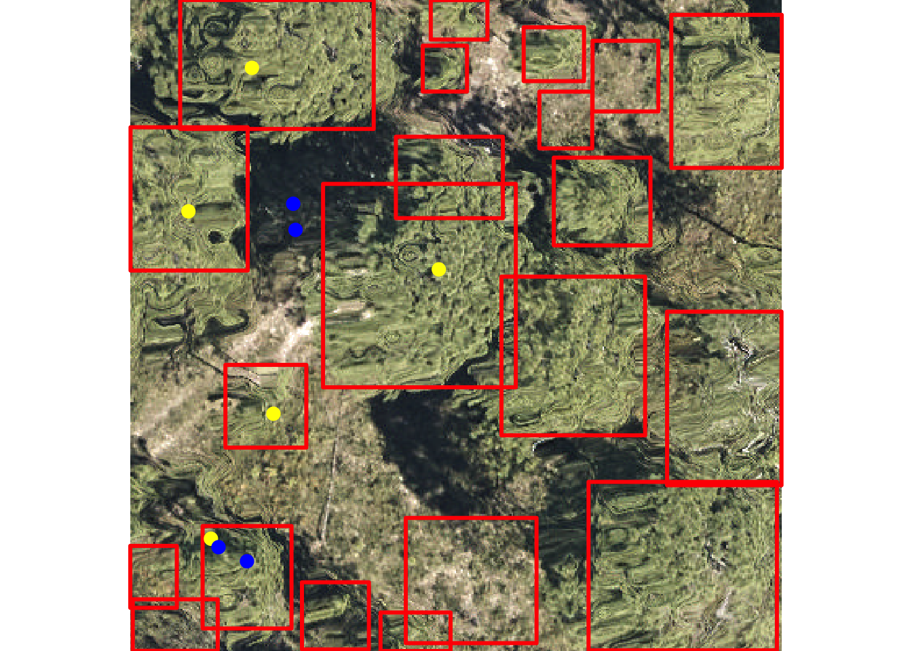
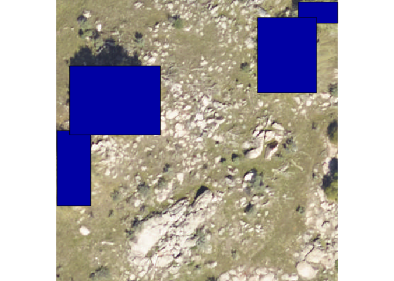

[](https://travis-ci.org/Weecology/NeonTreeEvaluation_package)

# A multi-sensor benchmark dataset for detecting individual trees in airborne RGB, Hyperspectral and LIDAR point clouds

Maintainer: Ben Weinstein - University of Florida.

# Paper and Citation

<https://www.biorxiv.org/content/10.1101/2020.11.16.385088v1>

Broad scale remote sensing promises to build forest inventories at
unprecedented scales. A crucial step in this process is designing
individual tree segmentation algorithms to associate pixels into
delineated tree crowns. While dozens of tree delineation algorithms have
been proposed, their performance is typically not compared based on
standard data or evaluation metrics, making it difficult to understand
which algorithms perform best under what circumstances. There is a need
for an open evaluation benchmark to minimize differences in reported
results due to data quality, forest type and evaluation metrics, and to
support evaluation of algorithms across a broad range of forest types.
Combining RGB, LiDAR and hyperspectral sensor data from the National
Ecological Observatory Network’s Airborne Observation Platform with
multiple types of evaluation data, we created a novel benchmark dataset
to assess individual tree delineation methods. This benchmark dataset
includes an R package to standardize evaluation metrics and simplify
comparisons between methods. The benchmark dataset contains over 6,000
image-annotated crowns, 424 field-annotated crowns, and 3,777 overstory
stem points from a wide range of forest types. In addition, we include
over 10,000 training crowns for optional use. We discuss the different
evaluation sources and assess the accuracy of the image-annotated crowns
by comparing annotations among multiple annotators as well as to
overlapping field-annotated crowns. We provide an example submission and
score for an open-source baseline for future methods.

# Installation

``` r
library(devtools)
install_github("Weecology/NeonTreeEvaluation_package")
```

# Download sensor data

To download evaluation data from the Zenodo archive (1GB), use the
download() function to place the data in the correct package location.
Download the much larger training data, set training=TRUE.

``` r
library(NeonTreeEvaluation)
download()
```

# Getting Started

The package contains two vignettes. The ‘Data’ vignette describes each
datatype and how to interact with it in R. The ‘Evaluation’ vignette
shows how to submit predictions to the benchmark.

# Submission Format

## CSV bounding boxes

The format of the submission is as follows

  - A csv file
  - 5 columns: plot\_name, xmin, ymin, xmax, ymax

Each row contains information for one predicted bounding box.

The plot\_name should be named the same as the files in the dataset
without extension (e.g. SJER\_021\_2018 not SJER\_021\_2018.tif) and not
the full path to the file on disk. Not all evaluation data are available
for all plots. Functions like evaluate\_field\_crowns and
evaluate\_image\_crowns will look for matching plot name and ignore
other plots.Depending on the speed of the algorithm, the simplest thing
to do is predict all images in the RGB folder (see list\_rgb()) and the
package will handle matching images with the correct data to the correct
evaluation procedure.

For a list of NEON site abbreviations:
<https://www.neonscience.org/field-sites/field-sites-map>

### Example

The package contains a sample submission file.

``` r
library(raster)
library(dplyr)
library(NeonTreeEvaluation)
head(submission)
#>        xmin     ymin      xmax     ymax     score label     plot_name
#> 1  41.01716 230.8854 151.08607 342.6985 0.8098674  Tree DSNY_014_2019
#> 2 357.32129 122.1164 397.57458 159.3758 0.6968824  Tree DSNY_014_2019
#> 3  30.39723 136.9157  73.79434 184.9473 0.5713338  Tree DSNY_014_2019
#> 4 260.65921 285.6689 299.68811 326.7933 0.5511004  Tree DSNY_014_2019
#> 5 179.34564 371.6130 232.49385 400.0000 0.4697072  Tree DSNY_014_2019
#> 6 316.27377 378.9802 363.67542 400.0000 0.3259409  Tree DSNY_014_2019
```

## Shp Polygons

Instead of bounding boxes, some methods may return polygons. To submit
as polygons, create a single unprojected shapefile with polygons in
image coordinates. Polygons must be complete with no holes. Here is an
example of the above csv file in polygon format. Here the xmin, xmax,
etc. columns are ignored since the information is stored in the geometry
data.

``` r
head(submission_polygons)
#> Simple feature collection with 6 features and 7 fields
#> geometry type:  POLYGON
#> dimension:      XY
#> bbox:           xmin: 30.39723 ymin: 122.1164 xmax: 397.5746 ymax: 400
#> CRS:            NA
#>        xmin     ymin      xmax     ymax     score label     plot_name
#> 1  41.01716 230.8854 151.08607 342.6985 0.8098674  Tree DSNY_014_2019
#> 2 357.32129 122.1164 397.57458 159.3758 0.6968824  Tree DSNY_014_2019
#> 3  30.39723 136.9157  73.79434 184.9473 0.5713338  Tree DSNY_014_2019
#> 4 260.65921 285.6689 299.68811 326.7933 0.5511004  Tree DSNY_014_2019
#> 5 179.34564 371.6130 232.49385 400.0000 0.4697072  Tree DSNY_014_2019
#> 6 316.27377 378.9802 363.67542 400.0000 0.3259409  Tree DSNY_014_2019
#>                      st_sfc.lst.
#> 1 POLYGON ((41.01716 230.8854...
#> 2 POLYGON ((357.3213 122.1164...
#> 3 POLYGON ((30.39723 136.9157...
#> 4 POLYGON ((260.6592 285.6689...
#> 5 POLYGON ((179.3456 371.613,...
#> 6 POLYGON ((316.2738 378.9802...
```

## Scores for an image-annotated crowns

| Author                | Precision | Recall | Cite/Code                                                                                         |
| --------------------- | --------- | ------ | ------------------------------------------------------------------------------------------------- |
| Weinstein et al. 2020 | 0.66      | 0.79   | <https://deepforest.readthedocs.io/>                                                              |
| Silva et al. 2016     | 0.34      | 0.47   | [lidR package](https://www.rdocumentation.org/packages/lidR/versions/1.6.1/topics/lastrees_silva) |

The main data source are image-annotated crowns, in which a single
observer annotated visible trees in 200 40m x 40m images from across the
United States. This submission has bounding boxes in image coordinates.
To get the benchmark score image-annotated ground truth data.

``` r
#Get a three sample plots to run quickly, ignore to run the entire dataset
df<-submission %>% filter(plot_name %in% c("SJER_052_2018"))

#Compute total recall and precision for the overlap data
results<-evaluate_image_crowns(predictions = df,project = T, show=F, summarize = T)
#> [1] "SJER_052_2018"
results[1:3]
#> $overall
#> # A tibble: 1 x 2
#>   precision recall
#>       <dbl>  <dbl>
#> 1         1  0.778
#> 
#> $by_site
#> # A tibble: 1 x 3
#> # Groups:   Site [1]
#>   Site  recall precision
#>   <chr>  <dbl>     <dbl>
#> 1 SJER   0.778         1
#> 
#> $plot_level
#> # A tibble: 1 x 3
#> # Groups:   plot_name [1]
#>   plot_name     recall precision
#>   <chr>          <dbl>     <dbl>
#> 1 SJER_052_2018  0.778         1
```

For a list of NEON site abbreviations:
<https://www.neonscience.org/field-sites/field-sites-map>

## Scores for an field-annotated crowns

| Author                | Recall | Cite/Code                            |
| --------------------- | ------ | ------------------------------------ |
| Weinstein et al. 2020 | 0.61   | <https://deepforest.readthedocs.io/> |

The second data source is a small number of field-annotated crowns from
two geographic sites. These crowns were drawn on a tablet while
physically standing in the field, thereby reducing the uncertainty in
crown segmentation.

``` r
df <- submission %>% filter(plot_name=="OSBS_95_competition")
results<-evaluate_field_crowns(predictions = df,project = T)
#> [1] "OSBS_95_competition"
```

<!-- -->

``` r
results
#> $overall
#> # A tibble: 1 x 2
#>   precision recall
#>       <dbl>  <dbl>
#> 1     0.029      1
#> 
#> $by_site
#> # A tibble: 1 x 3
#> # Groups:   Site [1]
#>   Site  recall precision
#>   <chr>  <dbl>     <dbl>
#> 1 <NA>       1     0.029
#> 
#> $plot_level
#> # A tibble: 1 x 3
#> # Groups:   plot_name [1]
#>   plot_name           recall precision
#>   <chr>                <dbl>     <dbl>
#> 1 OSBS_95_competition      1     0.029
```

## Scores for an field-collected stems

| Author                | Recall | Cite/Code                            |
| --------------------- | ------ | ------------------------------------ |
| Weinstein et al. 2020 | 0.74   | <https://deepforest.readthedocs.io/> |

The third data source is the NEON Woody Vegetation Structure Dataset.
Each tree stem is represented by a single point. This data has been
filtered to represent overstory trees visible in the remote sensing
imagery.

``` r
df <- submission %>% filter(plot_name=="JERC_049_2018")
results<-evaluate_field_stems(predictions = df,project = F, show=T, summarize = T)
#> [1] "JERC_049"
```

<!-- -->

``` r
results
#> $overall
#>      recall
#> 1 0.5555556
#> 
#> $by_site
#> # A tibble: 1 x 2
#>   Site  recall
#>   <fct>  <dbl>
#> 1 JERC   0.556
#> 
#> $plot_level
#>   siteID plot_name    recall n
#> 1   JERC  JERC_049 0.5555556 9
```

If you would prefer not to clone this repo, a static version of the
benchmark is here: <https://zenodo.org/record/3723357#.XqT_HlNKjOQ>

# Sensor Data

## RGB Camera

``` r
library(raster)
library(NeonTreeEvaluation)

#Read RGB image as projected raster
rgb_path<-get_data(plot_name = "SJER_021_2018",type="rgb")
rgb<-stack(rgb_path)

#Find path and parse
xmls<-get_data("SJER_021_2018",type="annotations")
annotations<-xml_parse(xmls)
#View one plot's annotations as polygons, project into UTM
#copy project utm zone (epsg), xml has no native projection metadata
xml_polygons <- boxes_to_spatial_polygons(annotations,rgb)

plotRGB(rgb)
plot(xml_polygons,add=T)
```

<!-- -->

## Lidar

To access the draped lidar hand annotations, use the “label” column.
Each tree has a unique integer.

``` r
library(lidR)
path<-get_data("TEAK_052_2018",type="lidar")
r<-readLAS(path)
trees<-lasfilter(r,!label==0)
plot(trees,color="label")
```

We elected to keep all points, regardless of whether they correspond to
tree annotation. Non-tree points have value 0. We highly recommend
removing these points before predicting the point cloud. Since the
annotations were made in the RGB and then draped on to the point cloud,
there will naturally be some erroneous points at the borders of trees.

## Hyperspectral

Hyperspectral surface reflectance (NEON ID: DP1.30006.001) is a 426 band
raster covering visible and near infrared spectrum.

``` r
path<-get_data("MLBS_071_2018",type="hyperspectral")
g<-stack(path)
nlayers(g)
#> [1] 426
#Grab a three band combination to view as false color
f<-g[[c(52,88,117)]]
plotRGB(f,stretch="lin")
```

<!-- -->

# Submission Ranks

To add score to this benchmark, please submit a pull request to this
README with the scores and the submission csv for confirmation.

## Citation

This benchmark is currently in review. Either cite this repo, or the
original article using these data: <sup>1</sup> Weinstein, Ben G., et
al. “Individual tree-crown detection in RGB imagery using
semi-supervised deep learning neural networks.” Remote Sensing 11.11
(2019): 1309. <https://www.mdpi.com/2072-4292/11/11/1309>
